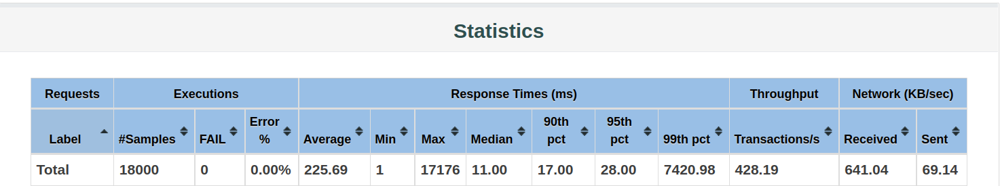
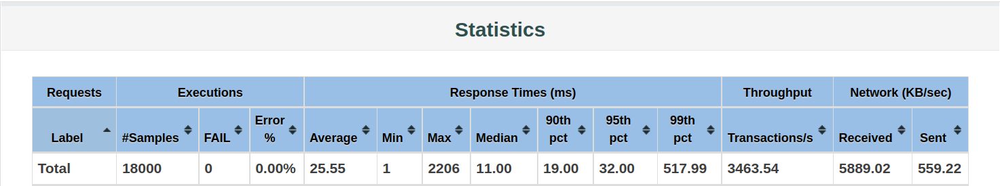

# 如何运行

我已经把数据库部署到了远程服务器上，所以只需要下载这个仓库的代码，依次启动每个服务实例即可：

```shell
git clone https://github.com/sawork-2022/aw10-final-YiyangSunn.git

cd aw10-final-YiyangSunn

mvn clean install

# 依次启动每个服务，可以直接在IDEA中操作
```

远程服务器是2核4G的，需要同时提供redis、mysql、mongodb和rabbitmq，所以感觉上会有一些延迟。

等所有服务完全启动之后，访问本机的8080端口就能看到前端页面，不需要单独启动pos-fronted。

前端有一个商品分类菜单，但这个分类并不完全（加起来不是所有数据），因为数据库里的分类信息比较乱。

# 系统介绍

目前的系统实现是综合了前面9次作业的结果，基本上只剩两件事没有做：一个是用docker部署微服务集群，还有一个是为数据库配置集群模式。这两件事在现有条件下实在是不方便操作，内存非常紧张，并且可能也没有必要做到这种程度。

系统中使用的是Amazon商品数据集，总共230万条记录。用户可以浏览、搜索、添加、购买商品，以及查看订单和物流信息。作业里有一个要求是说用户要能持续收到物流状态更新，说实话我不太清楚要怎么达到这个效果。我在物流服务里面写了一个Supplier每隔10秒钟向rabbitmq发送一条消息；然后又写了一个Consumer，在收到Supplier的消息后就给每条物流记录增加一个新状态。

我没有做用户管理，因为代价比较大；目前代码中是根据浏览器会话区分用户的，每个用户有自己的购物车数据和购买记录。各个微服务之间仍然保持下图的交互关系：


接下来我要简单说一说响应式宣言提到的4个要求具体是怎么实现的。

## Responsive

系统需要能够快速响应用户的请求。响应式编程确实能在一定程度上提高系统的吞吐量，这主要得益于它使用异步操作，可以把闲置的计算资源及时利用起来。每个系统都存在一个性能瓶颈，对于我们这个作业（包括对其它很多web应用来说），主要的性能瓶颈就是访问数据库。响应式编程可以提高业务层的处理速度，因为当其它请求卡在数据库访问上时，后来的请求仍然可以进行业务层操作。这样一些不涉及数据库访问，或者涉及的数据库查询比较简单的请求，就能更快的得到响应。

不过，本次作业的性能提升其实主要是对MySQL查询做了优化。除了使用redis缓存查询结果之外，我还在商品的分类字段上建立索引，以加快按类别查询的速度；在商品的名称字段上建立全文索引，从而加快关键字查询的速度：

```mysql
-- 建立类别索引
CREATE INDEX main_cat_index ON product(main_cat);

-- 建立关键字索引
CREATE FULLTEXT INDEX title_index ON product(title);
```

建立索引之后，还需要改写SQL语句以便索引能发挥作用：

```mysql
-- 按类别查询
SELECT * FROM product WHERE main_cat LIKE CONCAT(#{category}, '%') LIMIT #{start}, #{count};

-- 按关键字查询
SELECT * FROM product WHERE MATCH(title) AGAINST(#{keyword}) LIMIT #{start}, #{count};
```

其中模糊查询不要把通配符放在开头，通配符在前没法利用索引；MATCH...AGAINST...是全文索引的匹配方法。我用jmeter对商品服务做了简单的压力测试，每秒钟有100个用户发送请求，持续10秒。在没有建立索引的情况下，测试结果为：



详细的数据可以查看jmeter/products/without-index/index.html。在建立索引之后，使用同样的测试，得到的结果为：



详细的数据可以查看jmeter/products/with-index/index.html。

测试之前都清空了redis缓存，应用也是重启之后测试的。这里我们主要关注最大响应时间、99%分位点和吞吐量；平均时间因为使用了redis缓存被拉得很低，参考意义不是很大。可以看到建立索引确实是极大的提高了查询的速度。当然这里其实还有一个问题是测试中没有显现出来的：前端操作会发现越往后翻页越慢，查看最后一页比查看第一页慢很多。

这个问题主要是因为越往后LIMIT的偏移量越大，MySQL需要跳过很多条记录才能取回查询结果。网上对此问题有很多的解决方法，但其中绝大多数都不靠谱，或者需要前端配合以及牺牲一定的交互性。真正比较好的解决方法是把查询分为两次进行：

```mysql
-- 第一步先查商品的ID集合
SELECT product_id FROM product LIMIT #{start}, #{count};

-- 第二步根据ID查询商品数据
SELECT * FROM product WHERE product_id IN (...);
```

这样就会快很多：一方面商品ID只有几个字节，一次磁盘IO可以读很多个ID出来，原本SELECT *的写法光是读数据就要花很长时间；另一方面在索引结构上count也是很快的，不需要一条一条的数。综合以上优化之后，前端浏览商品页面就会很流畅了。

当然由于远程服务器只有2个核，会稍微慢一点点；另外系统整体的性能体验其实和前后端之间的交互也有关系。

坦诚的讲，这个作业里其它地方我都不是很关心，我最想说一下的就是这个MySQL查询是如何优化的，因为它的效果很显著，是真的好方法。

## Resilient

系统要有容错性，要能实现高可用。首先我们要知道这个系统中有哪些地方可能会broken：

* 服务实例可能挂掉。解决方法是启动多个服务实例，注册到服务中心；

* 服务中心可能挂掉。Eureka（包括其它选择）本身就支持集群配置；

* 网关可能挂掉。可以启动多个Gateway实例，再用Nginx做负载均衡，Nginx做双机热备；

* 基础设施可能挂掉。MySQL、Redis、RabbitMQ、MongoDB其实都支持主从复制和集群配置；

这里面我实际采用的只有redis集群，其它的都没法操作。我的机器内存只够每个服务启动一个实例；Eureka如果真要配置成集群，至少也要三个节点；Gateway集群 + Nginx双机热备，对这个作业本身的规模来说不是很有必要。MySQL因为使用Amazon的数据，单实例正常运行也需要消耗1.2G的内存。

总之，容错性主要是通过冗余来实现的。另外，服务限流和熔断机制也有一定帮助，目前代码里使用resilient4j来做服务熔断，可以防止微服务的雪崩。

## Elastic

系统要能方便的进行扩展。微服务架构本身就是很容易进行扩展的，虽然本次作业没有用docker部署，但其实要增加一个服务实例，也只需要把打包好的jar包上传启动就可以了。

商品数据存在MySQL里，用redis集群做缓存；订单数据、物流信息和购物车都存在MongoDB里；会话存在redis里。整个系统中数据和状态都是共享的，直接启动一个新实例，它就会自动注册到服务中心，加入整个微服务应用，从而实现水平向扩展。

另外，在docker里部署微服务集群其实有一些麻烦，像Eureka这样的服务中心得到的注册信息是docker容器中的虚拟IP，这会导致服务之间没法互调。通常我们可以用docker的容器发现来取代服务发现，就不再用单独的服务注册中心了。

## Message Driven

系统要是消息驱动的。一个系统能不能是消息驱动是由应用的性质决定的，需求决定架构。比如说用户希望点击下单之后，立刻就能看到付款结果，那这个操作就不能是消息驱动的。因为消息驱动意味着异步操作，而用户期望这里应该是一个同步结果。

还有一些应用只能是消息驱动的，比如说物流状态更新没有办法同步得到结果，它就只能依靠消息。目前代码里只有两处是消息驱动，一处是从订单创建物流；还有一处是物流状态的持续更新。

# 最终总结

总的来说，这个作业实现的还是比较简单的，受限于很多因素，然后我本身也不想做复杂。

最后我想客观的评价一下响应式编程：

* 响应式编程的确可以提高计算资源的利用率；

* 但目前对响应式编程的支持并不完善：

    * Spring Cache不能很好的和响应式集成，目前代码里是手动管理缓存的；
    
    * Spring Session在WebFlux下也会有各种各样的问题;

当然在适合响应式的地方，使用Reactive还是有好处的，比如Spring Cloud Gateway其实是一个比较好的响应式范例。
